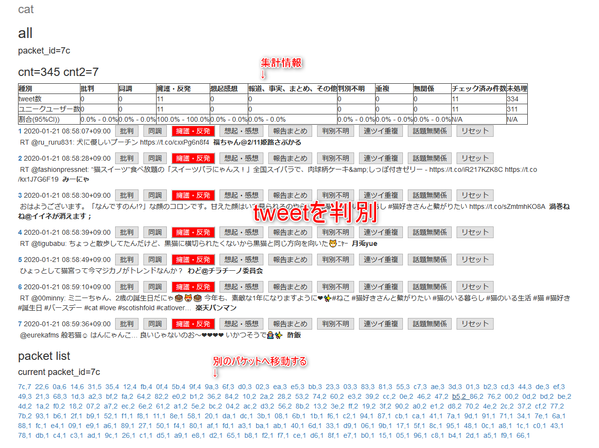

# twitter 炎上調査

# 概要

このアプリは、twitter上の炎上tweetを取得し、そのtweetが批判、中立、容認のどれなのかを調べるためのプログラムだ。

このプログラムは２つの部分からなっている。

1. tweetを取得するプログラム
1. 取得したプログラムを批判、中立、容認に仕分けるプログラム

である。
あくまでスケルトンプログラム(PoCを実施するプログラム)のため、あとは用途に合わせて変更することを望む。

# 必要ミドルウェア

[`mongo`](https://www.mongodb.com/)

mongo上に、取得したtweetの保存を行っている。

mongoは、ユーザー認証を設定する。 [参考](https://qiita.com/h6591/items/68a1ec445391be451d0d)

# 各種設定

`.env.sample` を参考に、`.env` ファイルを作る。

```
MONGO_HOST=(MONGOホスト)
MONGO_USER=ユーザー認証したユーザー
PASSWORD=MONGOのパスワード
AUTHSOURCE=MONGOのauthsource
SECRET_KEY=Flaskで使うsession key
MONGO_DB=tweetを取得する際のDB
COLLECTION=tweetを取得するコレクション
access_token=twitterの提供した認証キー
access_token_secret=twitterの提供した認証キー
consumer_key=twitterの提供した認証キー
consumer_key_secret=twitterの提供した認証キー
```

# 必要なpythonライブラリの取得

必要なpythonライブラリは、`requirements.txt` を用意しているので一括で取得できる。

`pip3 install -r requirements.txt`

# tweetを取得する。

tweetを取得するにはtwitterに開発者登録する必要がある。こちらを[参考](https://dev.classmethod.jp/etc/twitter-developer/)

開発者登録をして、 `access_token`,`access_token_secret`,`consumer_key`,`consumer_key_secret`を取得する。
`.env.sample` ファイルを参考に、`.env` ファイルを作る。
mongoへ保存するため、`MONGO_HOST` などを指定する。

`get_tweet.py`の関数 `get_tw()` 内の、`query` と `until` をほしい項目と期間を指定する。
twitterの[searchAPI](https://developer.twitter.com/en/docs/tweets/search/api-reference/get-search-tweets)は、プログラム実行時から7日前までのtweetしか検索出来ない。今日が、1/30だとすると、1/23までのデータしか検索できない。
`until` は、例えば1/26を指定すると、1/23-1/26までのデータが取れるという意味。

```
query=u'"猿" OR "雉"' # 猿と雉を含むtweetを検索する。 AND,ORを使える（小文字ではなく大文字で指定する）
until=datetime(2020,1,21) #取得したい期間を指定する。今日から７日前まで。
```

# 取得したtweetを表示するため、サーバを立ち上げる。

## date_dict.pyを指定して、表示する期間を制御する。

date_dictを指定することで、それが、炎上前なのか、炎上後１日目なのか、炎上後２日めなのか分けて表示できる

` ('all',datetime(2020,1,10,tzinfo=timezone),datetime(2020,1,30,tzinfo=timezone)),`

allという名前で、期間の範囲を指定できる。

```
date_dict={
    "cat":[　# コレクション名
        ('all',datetime(2020,1,10,tzinfo=timezone),datetime(2020,1,30,tzinfo=timezone)),
    ]}
```
例えば、
```
date_dict={
    "cat":[　# コレクション名
        ('プレ炎上',datetime(2020,1,10,tzinfo=timezone),datetime(2020,1,27,tzinfo=timezone)),
        ('炎上1日め',datetime(2020,1,27,tzinfo=timezone),datetime(2020,1,28,tzinfo=timezone)),
        ('炎上2日め',datetime(2020,1,28,tzinfo=timezone),datetime(2020,1,39,tzinfo=timezone)),
]}

```
などのように、日付で区切って、tweetを分類したい場合に使う（どのような場合でもpacket分割が基本）。


## サーバの立ち上げ

```
python3 srv.py
```
でポート5000で立ち上がる。

### 注意

GCPやEC2などを利用する際は、VPCなどで、port 5000番を開けておくこと。

## 使い方

### TOPページ

炎上した項目と、パケットを表示でするアコーディオンなので、クリックするとパケットが開く。

パケットとは、tweetidをもとに、tweetを分けたもの。全部を一気に見ると最初と最後で判断がずれていくので、パケットに分割したものを使って、炎上の開始から終わりまで一旦舐めることが出来る。それを何回も行うことで、炎上の開始点と、終了点で、判断を基準がずれることを防止する。


### 判別ページ

表示されたtweetが、批判、中立、容認なのかを判別する。
下のパケットページで別のページへ移動できる。



右の番号で、オリジナルのtweetに飛ぶことが出来る。

# テスト環境

```
"Ubuntu 18.04.3 LTS (Bionic Beaver)"
"Python 3.6.9 (default, Nov  7 2019, 10:44:02)"
```

